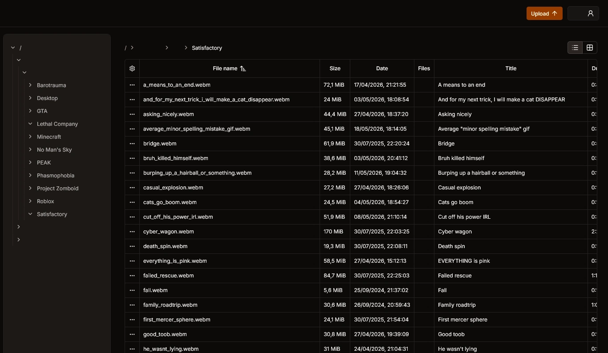
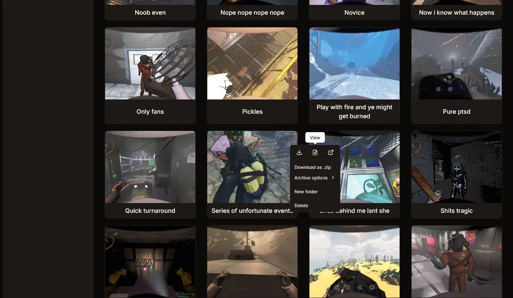
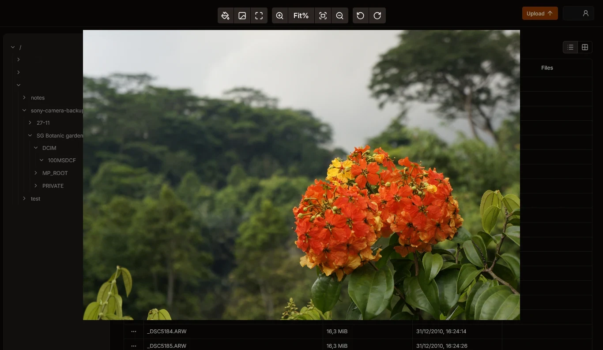

# Copyparty Vue

A custom copyparty frontend (and slight backend changes) made for me and my friends.

This is NOT intended as a full replacement of every base copyparty feature, it is meant for what _I_ use copyparty for:

- Media hosting (mostly game clips and pictures)
- Note taking (so good a markdown viewer, no editor yet)

Anything else is a bonus.

## I AIN'T DONE HERE YET

Missing features:

- Markdown editor
- Audio playback (you just download the file atm)
- Moving, copying and pasting files (across tabs)
- upget/recent uploads
- Grid view sorting and pagination

## Showcase

### List view of video files

### Grid view of video files with their thumbnails

### Media viewer

## Backend changes

So I made some changes with the backend meaning you can't just use this with vanilla copyparty.

Repository is [here](https://github.com/Joery-M/copyparty/tree/api-changes), with it being imported here as a submodule.

Changes include:

- Mounts page (`?h`) has a JSON version
- Option to disable thumbnail fallback (where it would show text instead of the image, now it'll just respond with 404)
- (In [other branch](https://github.com/Joery-M/copyparty/tree/custom-frontend)) Changes to allow bundling this Vue version as the default frontend

## Performance

Of course going for a complete JS frontend means you lose a bit of performance so I tested both version on a list of 102 items:

- Vanilla copyparty (without SSR): 96.54ms
- Vue: 129.17ms

My hope is that once vue vapor mode becomes stable, this can be taken down a healthy amount.

## Browser compatibility

I personally don't really care for a huge list of supported browsers, it's cool, but not my goal.

Off the top of my head the minimum browser version is:

- Chrome 108
- Safari 15.4
- Firefox 121

This is due to the usage of [`:has`](https://caniuse.com/?search=%3Ahas) and [viewport unit variants](https://caniuse.com/viewport-unit-variants).

Just update your browsers, everyone will be happier of you do.
